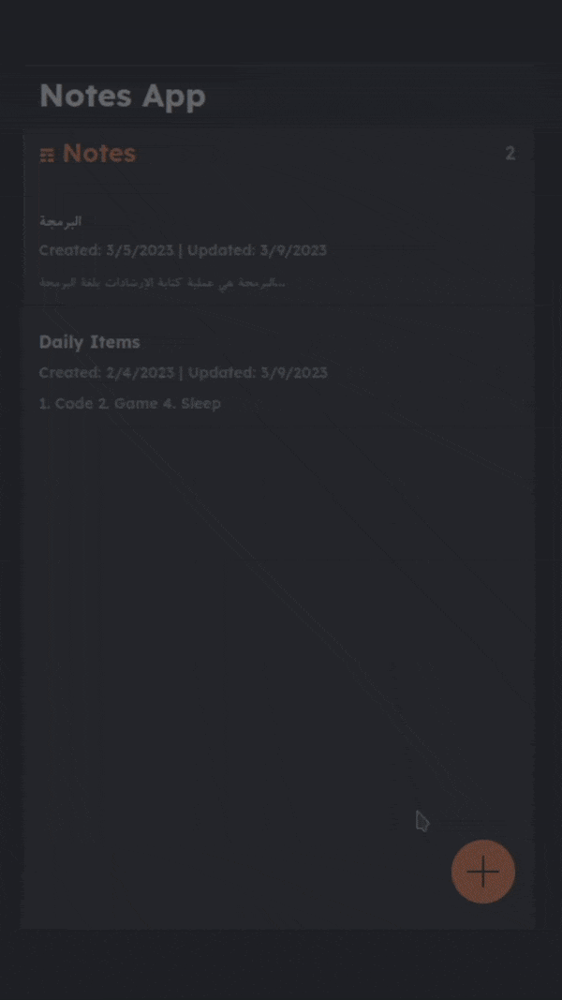

# Django-React-Notes-App
A simple note taking application with Django as the back-end and React as the front-end.

# Features:
1. Amazing UI/UX.
2. You can create, update, and delete notes.
3. Restful API.
4. ChatGPT powered. You can use ChatGPT to complete, translate, and more.

# Frameworks and Libraries used:
1. Django
    - [djangorestframework](https://www.django-rest-framework.org/).
    - [django-cors-headers](https://pypi.org/project/django-cors-headers/).
2. React.JS
    - [react-router-dom](https://reactrouter.com/en/main).
    - [sse.js](https://github.com/mpetazzoni/sse.js). Used to stream data just like OpenAI ChatGPT output.

# References
Big Thanks to the people that made this possible through their tutorials.

- [Django&React.js video tutorial](https://www.youtube.com/watch?v=tYKRAXIio28)
- [Django video tutorial](https://www.youtube.com/watch?v=trwXaGu-Lys)
- [Streaming ChatGPT Data tutorial](https://medium.com/codingthesmartway-com-blog/streaming-real-time-results-with-react-openai-and-server-sent-events-sse-a-step-by-step-guide-cc3d99c3374b)
- [OpenAI Docs](https://platform.openai.com/docs/api-reference/completions?lang=node.js)
